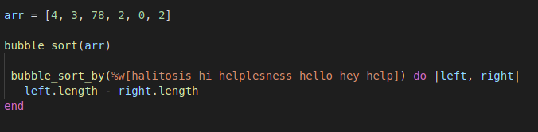
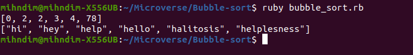

# Bubble-sort

> The bubble sort with Ruby

Bubble-sort is an algorithm for sorting items in an array according to a given criterion. By its operation each element is compared to the one next to it and they are swapped if the one on the left is larger than the one on the right. This continues until the array is eventually sorted.

## Built With

- Ruby

## Authors

👤 **Author1**

- GitHub: [@mihdim2020](https://github.com/mihndim2020)
- Twitter: [@mihndim](https://twitter.com/mihndim2020)
- LinkedIn: [Mih Julius](https://linkedin.com/mih-julius)

👤 **Author2**

- GitHub: [@German-Cobian](https://github.com/German-Cobian)
- Twitter: [@GermanCobian3](https://twitter.com/GermanCobian3)
- LinkedIn: [German Cobian](https://linkedin.com/german-cobian)

## 🤝 Contributing

Contributions, issues, and feature requests are welcome!

Feel free to check the [issues page](issues/).

## Show your support

Give a ⭐️ if you like this project!

## Acknowledgments

- Coding partner
- Standup team
- Mentor
-Microverse community

## 📝 License

MIT License

Copyright (c) 2021 Mihndim Julius and German Cobian

Permission is hereby granted, free of charge, to any person obtaining a copy
of this software and associated documentation files (the "Software"), to deal
in the Software without restriction, including without limitation the rights
to use, copy, modify, merge, publish, distribute, sublicense, and/or sell
copies of the Software, and to permit persons to whom the Software is
furnished to do so, subject to the following conditions:

The above copyright notice and this permission notice shall be included in all
copies or substantial portions of the Software.

THE SOFTWARE IS PROVIDED "AS IS", WITHOUT WARRANTY OF ANY KIND, EXPRESS OR
IMPLIED, INCLUDING BUT NOT LIMITED TO THE WARRANTIES OF MERCHANTABILITY,
FITNESS FOR A PARTICULAR PURPOSE AND NONINFRINGEMENT. IN NO EVENT SHALL THE
AUTHORS OR COPYRIGHT HOLDERS BE LIABLE FOR ANY CLAIM, DAMAGES OR OTHER
LIABILITY, WHETHER IN AN ACTION OF CONTRACT, TORT OR OTHERWISE, ARISING FROM,
OUT OF OR IN CONNECTION WITH THE SOFTWARE OR THE USE OR OTHER DEALINGS IN THE
SOFTWARE.
